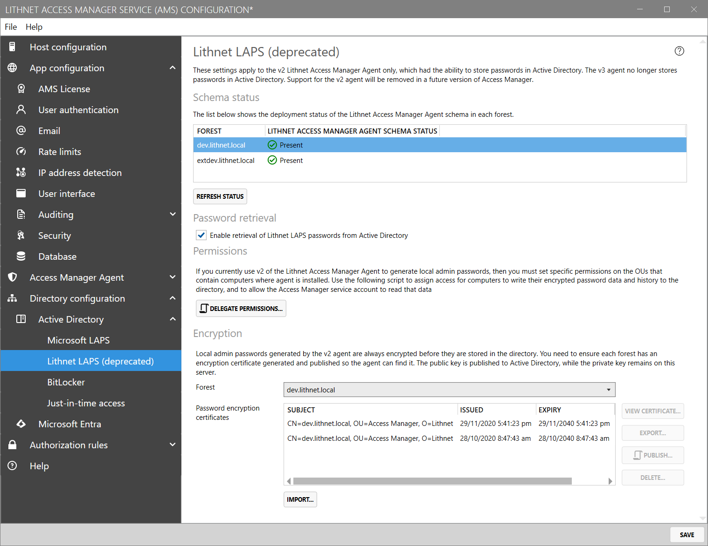

# Lithnet LAPS configuration page (Active Directory)

 Lithnet LAPS is an [Enterprise edition feature](../../access-manager-editions.md)

## Schema

A list of forests is shown along with an indication of the deployment status of the Lithnet Access Manager Agent schema.

You can use the `Deploy Schema...` button to access a script that will deploy the Lithnet Access Manager schema to the selected forest. You'll need to run this script as a member of the Schema Admins group in the forest you need to update.

## Permissions

If you want to use the Lithnet Access Manager agent instead of the Microsoft LAPS agent, to take advantage of the password history and encryption capabilities, then you'll need to delegate appropriate permission for the AMS service account to read those passwords.

Click the `Delegate permissions` button to generate a script to do this automatically.

Copy or save the script, modify the `$OU` variable as appropriate, and run it in with domain admin rights.

## Encryption

Each forest in the domain must have an encryption certificate published in order to deploy the Lithnet Access Manager Agent. Select a forest from the drop down list, to see the encryption certificates available for that forest. Only one certificate can be published at any one time.

You can rotate these certificates as often as you like, but you need to ensure that the certificate used to encrypt a given password is available for as long as it is stored in the directory. Agents cannot decrypt their own passwords, so once they have encrypted it with a given certificate, it can only be decrypted with the same certificate.

### List columns

#### Subject

Shows the forest that the encryption certificate was issued for

#### Issued

Shows the date that the certificate was generated

#### Expiry

Shows the date that the certificate will expire

#### Published

Indicates whether the certificate is correctly published in the directory. Clients in this forest will currently use this certificate to encrypt their passwords.

## Generating a new encryption certificate

At any time you can generate a new encryption certificate by clicking the `Generate new` button. Clients will not use this new certificate until you publish it in the directory. Use the `Publish` button to generate a script to deploy the public key into the forest. This script must be run as a member of the `domain admins` group in the root domain of the forest. Publishing a new certificate will overwrite any existing certificate in use.

If there are previously used certificates shown here, don't remove them. If clients have encrypted their passwords or password history with these old certificates, the AMS service will need them to be able to decrypt them.

## Backing up the private key

It is imperative that you have a safe and secure backup of your encryption keys. Select a certificate to back up and click `View Certificate`. From the `Details` tab, click `Copy to file...`. This will launch the export certificate wizard, which will allow you to export the certificate and private key to a PFX file. Choose a strong password for the PFX, and store the file somewhere safe. It's best to have multiple copies of the file, including an 'offline' copy.

See the guide on [restoring an encryption certificate from backup](../advanced-help-topics/backup-and-restore.md) for details on how to restore an existing key from a backup.

If you've lost the private key, you can force the agents to set new passwords and encrypt them with a new key by reading the [recovering from a lost encryption certificate](../advanced-help-topics/recovering-from-a-lost-encryption-certificate.md) guide. Unfortunately, there is no way to recover the encrypted password history.
