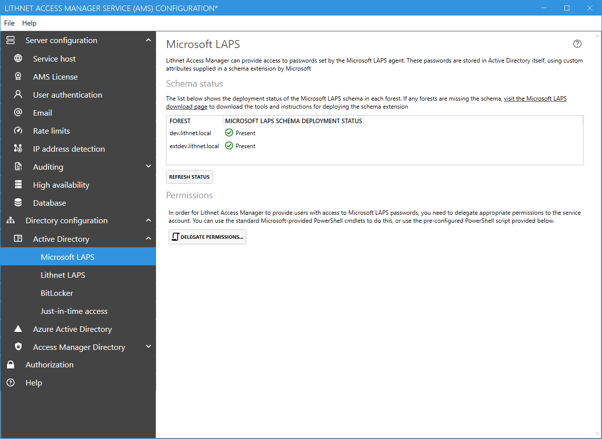
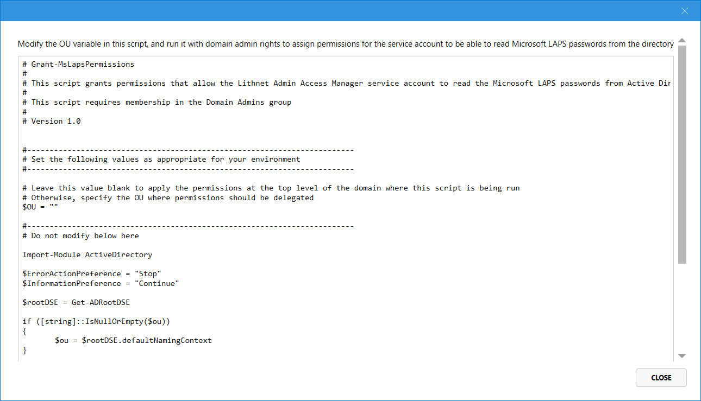

# Microsoft LAPS configuration page

## Schema

A list of forests is shown along with an indication of the deployment status of the Microsoft LAPS schema.

If you need to deploy the Microsoft LAPS schema, refer to the [Microsoft guides](https://aka.ms/laps) on how to complete this process.

## Permissions

If you plan on using Lithnet Access Manager to read Microsoft LAPS passwords, you'll need to delegate permission for the AMS service account to read those passwords. You can use the built-in cmdlets from the AdmPwd PowerShell module, or click the `Delegate Microsoft LAPS Permissions` button to generate a script to do this automatically.

Copy or save the script, modify the `$OU` variable as appropriate, and run it in with domain admin rights.
