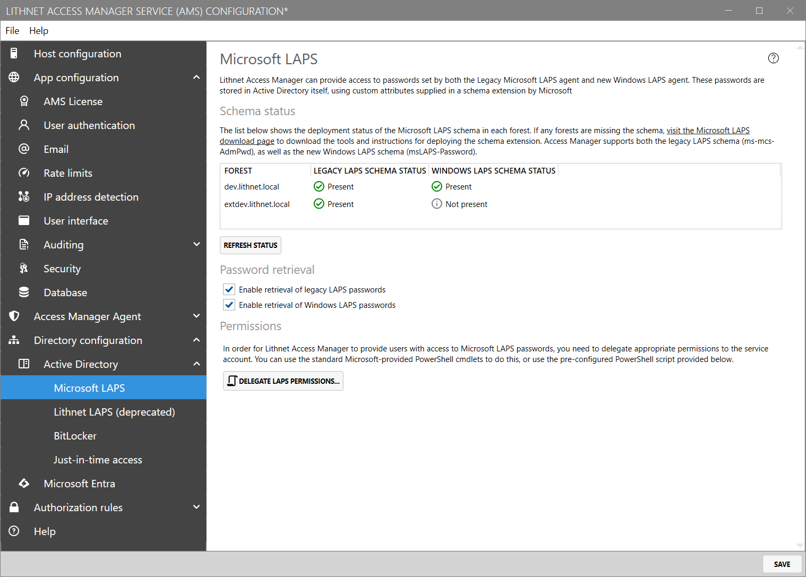

# Microsoft LAPS configuration page

Access Manager can read LAPS passwords from Active Directory generated by both the new and legacy Microsoft LAPS agents.

## Schema

A list of forests is shown along with an indication of the deployment status of the legacy and new Microsoft LAPS schemas.

The legacy, or classic, Microsoft LAPS schema uses an attribute called `ms-mcs-admpwd` to store the local admin password in plain text.

The new Windows LAPS agent in Windows 11 uses attributes called [`msLAPS-Password` and `msLAPS-EncryptedPassword`](https://learn.microsoft.com/en-us/windows-server/identity/laps/laps-technical-reference).

If you need to deploy the Microsoft LAPS schema, refer to the [Microsoft guides](https://aka.ms/laps) on how to complete this process.

## Password retrieval

### Enable retrieval of legacy LAPS passwords

When configured, Access Manager will attempt to retrieve passwords stored in Active Directory stored by the "legacy" or "classic" Microsoft LAPS agent.

### Enable retrieval of Windows LAPS passwords

When configured, Access Manager will attempt to retrieve passwords stored in Active Directory stored by the new Windows LAPS agent in either encrypted or unencrypted form.

This includes the ability to read encrypted passwords, as well as password history from Active Directory.

## Permissions

If you plan on using Lithnet Access Manager to read Microsoft LAPS passwords, you'll need to delegate permission for the AMS service account to read those passwords. You can use the built-in cmdlets from Microsoft's PowerShell modules, or click the `Delegate Microsoft LAPS Permissions` button to generate a script to do this automatically.

Copy or save the script, modify the `$OU` variable as appropriate, and run it in with domain admin rights.
