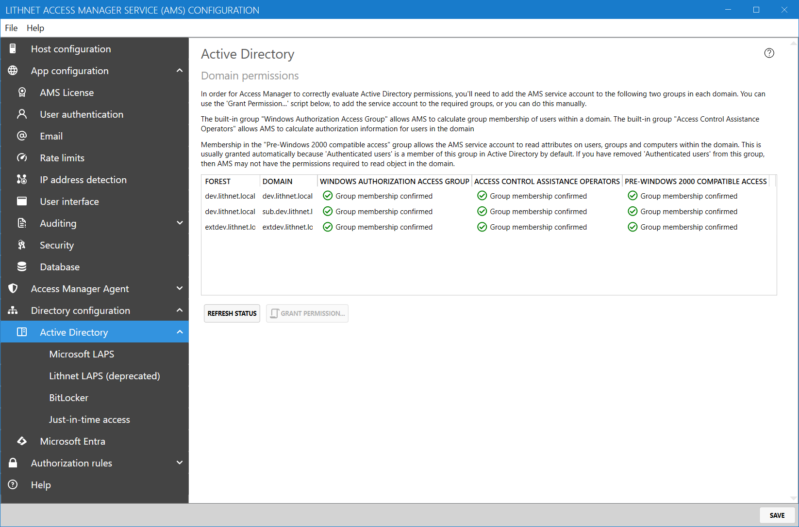

# Active Directory configuration page

## Domain Permissions

In order for the Access Manager service to evaluate user permissions, its service account needs to be a member of three built-in groups of each domain. The first is the `Windows Authorization Access Group`. This allows the service account to compute the `tokenAndUniversalGroups` for a user in the directory. This ensures that the service account can see the user's full group membership.

The second group is the `Access Control Assistance Operators` group. This allows Access Manager to ask a domain controller in a trusting forest to perform access checks on its behalf. Membership in this group is not technically required in the domain and forest that the Access Manager Service runs in.

The final group is the `Pre-Windows 2000 compatible access` group. This group allows Access Manager to read objects within the domain. Usually, permission is granted automatically by the fact that this group, by default, contains the special `Authenticated users` principal. If you have removed `Authenticated users` from this group for security or privacy reasons, you'll need to make sure that the AMS service account can read objects in the domain. The easiest way to achieve this is to add the service account to the `Pre-Windows 2000 compatible access` group. Alternatively, you can manually grant permissions for the service account to read all properties of groups, users and computers in the domain (Note that the user interface will still show a group membership warning in this case).

These groups provide read only access to authorization information within the domain.
