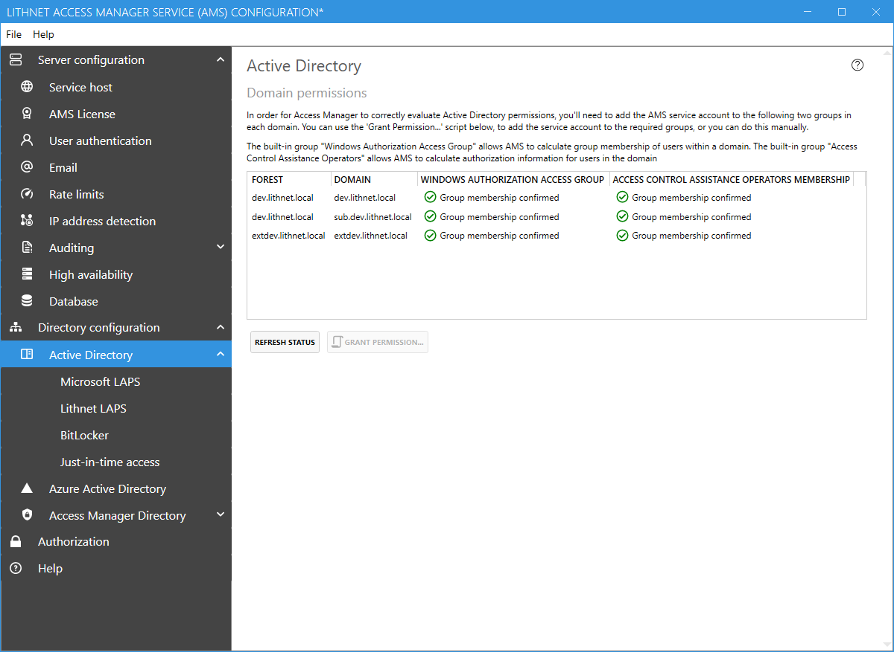

# Active Directory configuration page

## Domain Permissions

In order for the Access Manager service to evaluate user permissions, its service account needs to be a member of two built-in groups of each domain. The first is the `Windows Authorization Access Group`. This allows the service account to compute the `tokenAndUniversalGroups` for a user in the directory. This ensures that the service account can see the user's full group membership.

The second group is the `Access Control Assistance Operators` group. This allows Access Manager to ask a domain controller in a trusting forest to perform access checks on its behalf. Membership in this group is not technically required in the domain and forest that the Access Manager Service runs in.

These groups provide read only access to authorization information within the domain.
