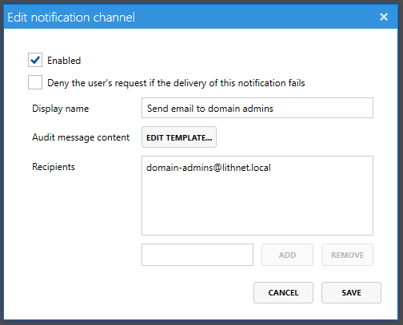
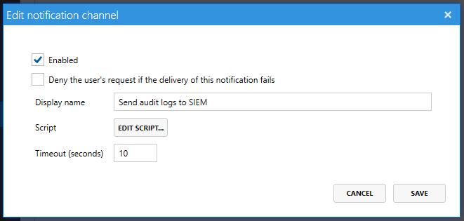

# Auditing page

Access Manager always logs events to the Windows event log, but you can also have it deliver notifications via email, web hooks, or even PowerShell.

## Windows event log

Audit events are always logged to the Windows event log. Access Manager allows you to customize the content of the log message using the `Edit Template` button.

## Splunk

Access Manager can be configured to forward all audit events to Splunk via HEC (HTTP Event Collector).

You can configure connectivity to a Splunk instance using the `Splunk Settings` button.

You can configure HEC endpoints and tokens for use with Access Manager for both [Splunk Cloud](https://docs.splunk.com/Documentation/SplunkCloud/latest/Data/UsetheHTTPEventCollector#Configure_HTTP_Event_Collector_on_Splunk_Cloud_Platform) and [Splunk Enterprise](https://docs.splunk.com/Documentation/SplunkCloud/latest/Data/UsetheHTTPEventCollector#Configure_HTTP_Event_Collector_on_Splunk_Enterprise).

### Splunk Settings

#### Enabled

Indicates if Splunk audit log fowarding is currently enabled. If it is not enabled, audit events will not be sent to Splunk.

#### Required

This setting needs very careful consideration before turning this flag on. When enabled, AMS will wait to grant access to the user until the audit log is delivered to Splunk. If Splunk takes a long time to process the audit log - or connectivity to Splunk is lost - this will result in the user waiting a long time for their access request to process on the web page (or timing out completely). Only enable this setting if auditing to the notification channel is critical.

#### HTTP event collector host

This is the fully-qualified domain name (FQDN) to use for connecting to the Splunk HEC endpoint.

#### Protocol

The protocol to use when connecting to the Splunk HEC endpoint. Defaults to HTTPS.

Optionally, you can disable certificate verification for the HEC endpoint's certificiate, if required.

#### Port

The port to use when connecting to the Splunk HEC endpoint; 

#### HEC token

The HEC token used to authenticate to the Splunk HEC endpoint.

For more information on creating HEC tokens for use with Access Manager, refer to the relevant documentation for either [Splunk Cloud](https://docs.splunk.com/Documentation/SplunkCloud/latest/Data/UsetheHTTPEventCollector#Configure_HTTP_Event_Collector_on_Splunk_Cloud_Platform) or [Splunk Enterprise](https://docs.splunk.com/Documentation/SplunkCloud/latest/Data/UsetheHTTPEventCollector#Configure_HTTP_Event_Collector_on_Splunk_Enterprise).

This token should have the correct permissions to write to the index (with the designated `sourcetype`) configured below.

#### Target index

All audit messages delivered to Splunk will be sent to this index.

#### Source type

All audit messages delivered to Splunk will include this value as the `sourcetype` field. This field defaults to `lithnet:accessmanager`

## Global event logging

The global settings section defines which channels should be always notified of a success or failure event. This is in addition to any notification channels defined on a specific authorization rule.

If you want to make sure a channel is notified on every success or failure, then add those channels to this list.

## Notification Channels

Access Manager uses the concept of a notification channel to define what event information should be sent to where, and how it should be delivered. Notification channels are attached to authorization rules and are sent when access to a computer or role is granted or denied.

**SMTP channels** allow for the delivery of audit events via an HTML formatted email.

**Webhooks** are a convenient way to send notifications to 3rd party systems. Using a simple JSON payload, you're able to push audit information to systems that support webhooks such as Microsoft Teams and Slack.

Finally, **PowerShell** can be used to perform custom audit actions and send notifications to any system you can connect to from PowerShell.

## Common notification channel settings

The following settings apply to all channel types

#### Enabled

Indicates if the notification channel is currently enabled. If it is not enabled, audit events will not be sent to this channel.

#### Deny the user's request if the delivery of this notification fails

This setting needs very careful consideration before turning this flag on. When enabled, AMS will wait to grant access to the user until the notification is sent. If the notification channel takes a long time to process, this will result in the user waiting a long time for their access request to process on the web page. Only enable this setting if auditing to the notification channel is critical. It is important to note that events are _always_ logged to the Windows event log. If the request fails to log to the event log, the request is denied. So there will always be at least one record of a successful access attempt.

#### Display name

A friendly name that is used through the configuration tool to refer to this notification channel.

## SMTP Channels

#### Audit message content

Edits the HTML file used as a template for an audit event.

AMS comes with a sample HTML template that you can customize to suit your requirements. See the page on [audit variables](../advanced-help-topics/audit-variables.md) for a list of the fields that are valid to use inside the email template.

#### Recipients

A list of email recipients that the audit notification should be sent to

## Webhook Channels

#### URL

This is the webhook URL provided by the target application.

#### HTTP Method

Specifies the type of HTTP request to make. This will almost always be `POST`, but in the event that your web hook target requires another value you can specify that here.

#### Content-Type header

Specifies the `Content-Type` header used in the HTTP request. This will almost always be `application/json` for a JSON payload. If your web hook target requires a different value, then specify that here.

#### Audit message content

Edits the JSON file used as a template for an audit event.

AMS comes with sample JSON templates for Microsoft Teams and Slack that you can customize to suit your requirements. See the page on [audit variables](../advanced-help-topics/audit-variables.md) for a list of the fields that are valid to use inside the JSON template.

## PowerShell Channels

#### Script

Edit or import a PowerShell script file to execute

## Template variables

All notification channel types populate notification templates by replacing placeholder variables with data from the event. The [audit variables](../advanced-help-topics/audit-variables.md) page contains a full list of all valid variables that you can use throughout your templates and scripts.
