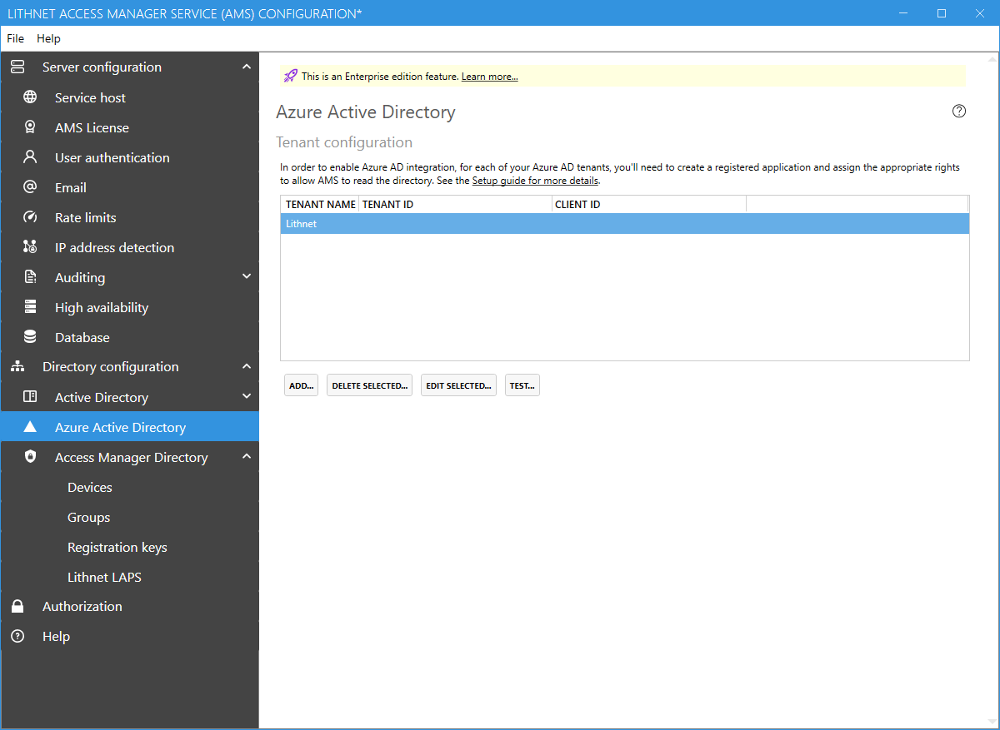

# Azure Active Directory configuration page

 Azure AD support is an [Enterprise edition feature](../../access-manager-editions.md)

## Tenant configuration

In order to support Azure AD-joined and Azure AD-registered devices, you must configure Access Manager with access to your Azure AD tenant. See the guide for [setting up the AMS directory](../../configuration/deploying-features/setting-up-lithnet-laps/configuring-lithnet-laps-for-the-ams-directory.md) for instructions on how to configure you tenant.
