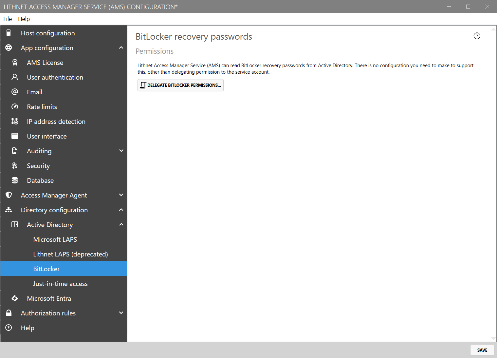

# BitLocker configuration page

You can access BitLocker recovery passwords stored in Active Directory using Lithnet Access Manager. No specific configuration is needed, other than delegating permission for the AMS service account to read those passwords from the directory.

Once directory permissions are granted to the service account, you can assign access to users using [authorization rules](computer-authorization-rules-page.md).
