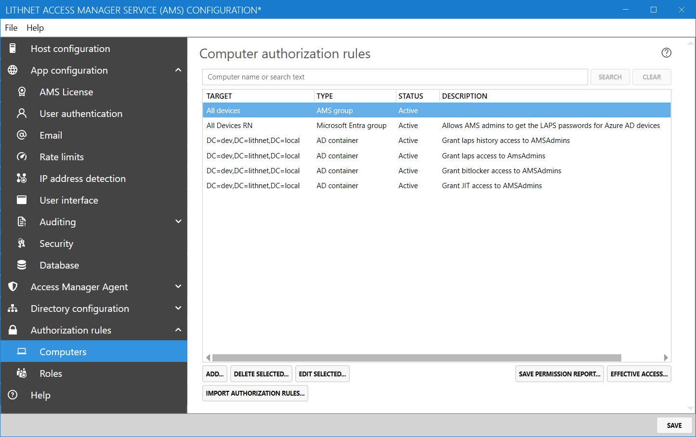
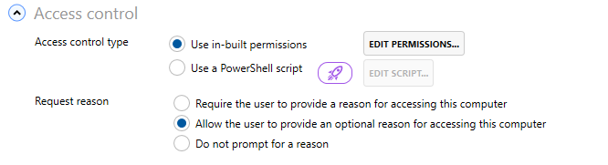
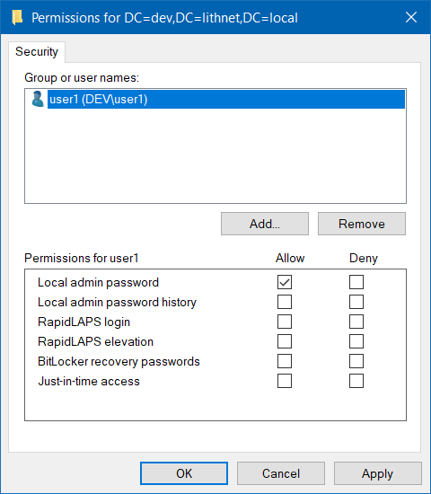
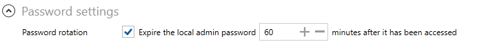
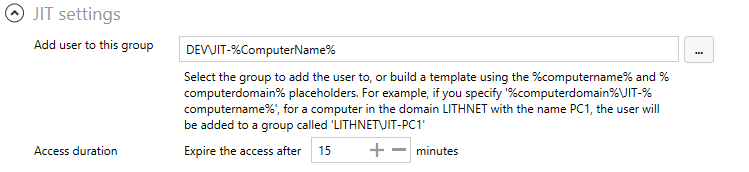

# Computer authorization rules page

## Computer authorization rules

Access to computers is provided through authorization rules. An authorization rule defines a target (either a computer, group of computers, or a container), who is allowed to access that target, and what access type they can obtain.

You can add, edit and delete individual rules using the authorization rule editor.

There are several other helpful tools on this page. To determine the effective access a user has to a particular computer, use the [Effective access](effective-access-page.md) tool.

You can build your authorization rule set by [importing authorization rules](../../configuration/importing/) from other sources where users already have permissions.

The `Save permission report` tool allows you to export a list of all the principals that are granted access via the selected rules to a CSV file. Note, that any PowerShell based rules are not included in this report.

### Authorization rule editor

#### Rule settings

A target is a computer, group, or container that you want to grant access to. A target can be one of the following types of object

* An Active Directory domain, organizational unit, or container
* An Active Directory group
* An Active Directory computer object
* An Azure AD device
* An Azure AD group
* An AMS-registered device
* An AMS-registered group

A target can be in any domain visible to AMS, including domains from forests that trust the forest where AMS resides, an Azure AD device or group, or an AMS-managed device or group.

When evaluating access, rules are evaluated in the following order;

1. Computer targets
2. Group targets
3. Container targets, in order of their distance to computer object (parent containers processed before grandparents, etc.)

If a user matches more than one authorization rule, the first matched target according to the order above will be used.

If a 'deny' ACL is encountered for a user, they will be denied access regardless of target order or type.

You can disable an authorization rule by selecting the `disable rule` checkbox. You can also choose to expire the rule at a certain point, by checking the `expire rule` checkbox and selecting the date and time the rule should expire.

#### Access control

AMS allows you to determine who is authorized to access a target, and what they can access. You can do this through the built-in permission editor or if you have complex authorization rules, you can use a PowerShell script to determine access.

**Use in-built permissions**

The first is the built-in permission editor. This is where you define an ACL that determines who can access a computer and what type of access they can get.

Add users and groups to this list and select the type of access they should be allowed or denied.

 Access to local admin password history is an [Enterprise edition feature](../../access-manager-editions.md)

**Use a PowerShell script**

 PowerShell-based authorization scripts are an [Enterprise edition feature](../../access-manager-editions.md)

You can also use a PowerShell script to determine if a user should be allowed to access a computer. This allows you to call into an external system to make an authorization decision.

See the page on [Authorization scripts](../advanced-help-topics/authorization-scripts.md) for more information on the script format.

#### Request reason
When a user accesses a role, you can prompt them to provide a reason for accessing the role. You can choose to make this prompt mandatory, optional, or not shown at all.

#### Local admin password settings

If at least one of your ACLs allows access to the local admin passwords of the specified targets, then you'll have an option that allows you to choose to expire the local admin password after it has been accessed.

This has the effect of setting the expiry date for the password in the directory to a new date based on the interval you specify. The password be rotated the next time the Microsoft LAPS or Lithnet Access Manager agents check in _after_ this new time. Note, that the Microsoft LAPS client checks the password at group policy refresh time (every \~90 minutes) and the Lithnet Access Manager agent by default, checks every 60 minutes, so rotations may be delayed by these intervals.

#### Just-in-time access settings

If at least one of your ACLs allows JIT access to computers matching in the target, then you'll need to specify the JIT group and expiry settings.

**JIT group**

Select the group that grants the user administrative access to the target. You can select a specific group from the directory, or provide a templated name that will be built at authorization time. You can use the following placeholders in the name, which will be substituted with the details from the computer the user was granted access to.

* `%computerName%`
* `%computerDomain%`

For example, using a templated name of `%computerDomain%\JIT-%computerName%` will expand to `DEV1\JIT-PC1` for a computer named `PC1` in the domain `DEV1`.

This functionality makes it very easy to ensure that each computer has an individual JIT group that provides access to only that computer. Use the same template in combination with the AMS feature to automatically create JIT groups, and use group policy preferences to add that group to the local admin group on each computer. See the [setting up JIT](../../configuration/deploying-features/setting-up-jit-access.md) guide for more details.

**Expiry**

Set the duration of time after which the user will be removed from the JIT access group.

**Notifications**

Set the audit notification channels you want to be notified on success or failure events for this rule. See [the auditing](auditing-page.md) help topic for information about creating notification channels.
