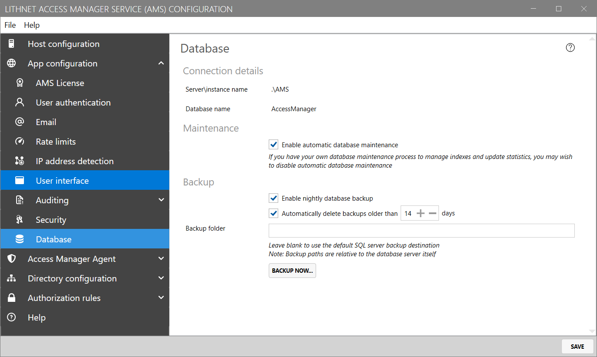

# Database configuration page

## Connection details

This shows the current server and database name used by the Access Manager service.

## Maintenance

### Enable automatic database maintenance

This option configures AMS to automatically perform required maintenance to indexes and statistics. You can disable this if you have your own scripts to manage database maintenance.

It is recommended to leave this setting enabled.

## Backup (only available for SQL Express installations)
If you are using the pre-configured SQL Express engine, configured at installation time, then you will see additional options related to backing up the database. 

If you are using Azure SQL, Amazon RDS, or an external SQL server, then you must configure backups in those systems. The in-built backup options will not be shown.

### Enable nightly database backup

You can have Access Manager automatically backup the AMS database each night using the built-in SQL server backup mechanism. If you have your own backup system in place, disable this setting so as not to cause conflicts.

### Automatically delete backups older than X days

If AMS is configured for automatic backup, you can choose how many days worth of backups you want to keep. Backups older than the specified period will be automatically purged.

### Backup folder

By default, SQL server has a default folder configured for storing backups. You can override the automatic backup location by specifying another path here. Note, that this path must be relative to the SQL server itself, and the SQL service account must have appropriate permission to this location.
