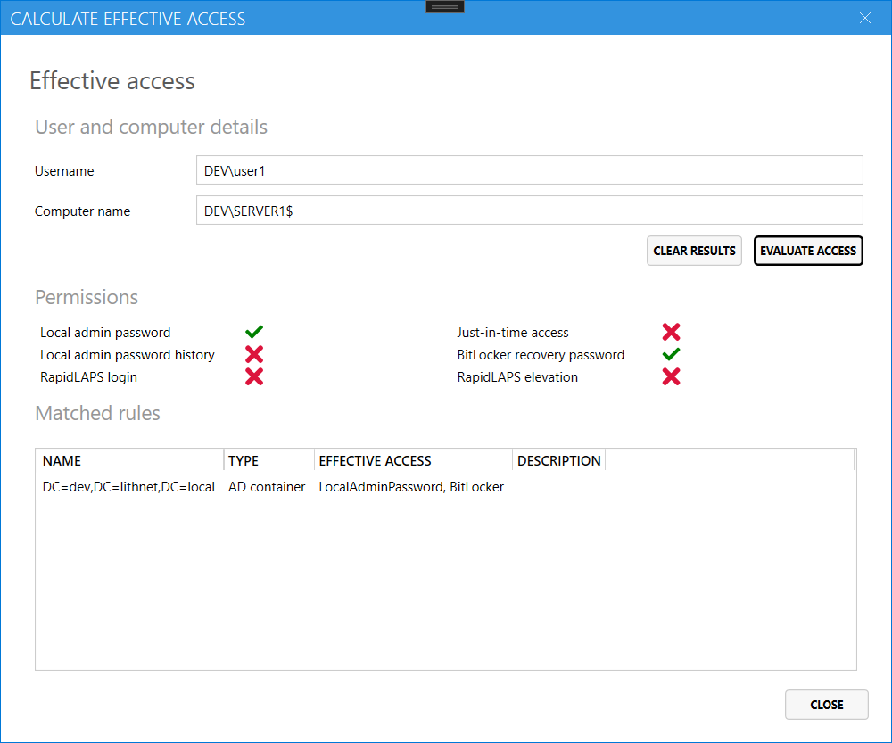

# Effective access page

The Access Manager UI can calculate the effective permissions for a user. Simply provide a username and computer name and click `Evaluate access` to see what permissions the user has, and which rules grant that permission.

