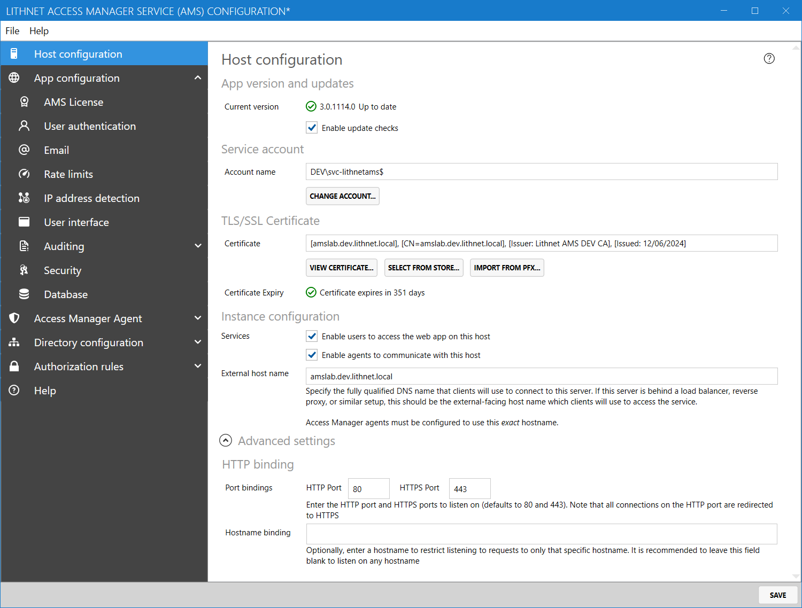
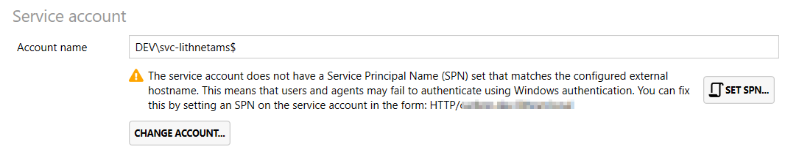

# Host configuration page

Settings on this page apply to the physical host computer only. If you have more than one Access Manager server, these settings will be unique to each server.

## App version and updates

Shows the current application version, and optionally shows you if there is a new version of the application available. You can prevent the application from checking for updates, by disabling the `Enable update checks` option. Note that this only checks to see if updates are available. Updates must always be downloaded and installed manually.

## Service account

Specifies the service account that runs the Access Manager Service application. Use a group-managed service account wherever possible.

Before you change the service account, make sure the database permissions allow the new account to connect. If you are using the built-in SQL Express database, you do not need to make any manual changes.


If you wish to allow agents to register with their Active Directory identity, or allow users to authenticate with Windows Authentication, you will need to configure a service principal name (SPN) on the service account used by the Access Manager Service.

If this SPN is not set, the following warning will appear in the `Service account` section of the `Host configuration` page:



## TLS/SSL Certificate

### Certificate

Specify the TLS certificate used to protect HTTPS traffic to and from the website. You can select a certificate from the local machine store, or import a PFX file.

### Certificate expiry

Shows how long until the currently selected certificate expires.

## Instance configuration

### Services

* **Enable users to access the web app on this host**: When enabled, this host will serve the Access Manager web app. You can disable this if you want to have a host that is used only by agents or only for configuration.
* **Enable agents to communicate with this host**: When enabled, the Access Manager agent API is activated, allowing devices with the Lithnet Access Manager Agent installed to communicate with this server and manage their local admin passwords.

### External host name

You must specify a valid DNS name that will be used by end users and Access Manager Agents to contact this host. This name must match exactly with the AMS server name configured on the agents themselves, and it must be present in the HTTPS certificate used by the service.

If Access Manager is configured behind a load balancer, etc., this field should match the domain name configured on the load balancer.


If this value differs from the AMS server name configured in the agent at installation time, the agent will be unable to communicate with the server


## Advanced Settings

### Port bindings

* **HTTP Port**: The HTTP port that the application will listen on. The default is port `80`.
  * Note: this port is only used to redirect connections to HTTPS. The application won't serve content over non HTTPS connections.
* **HTTPS Port**: The HTTPS port that the application will listen on. The default is port `443`.

### Hostname binding

If configured, this option will force Access Manager to only respond to specific host names. It is generally recommended to leave this field blank to listen on any hostname.
