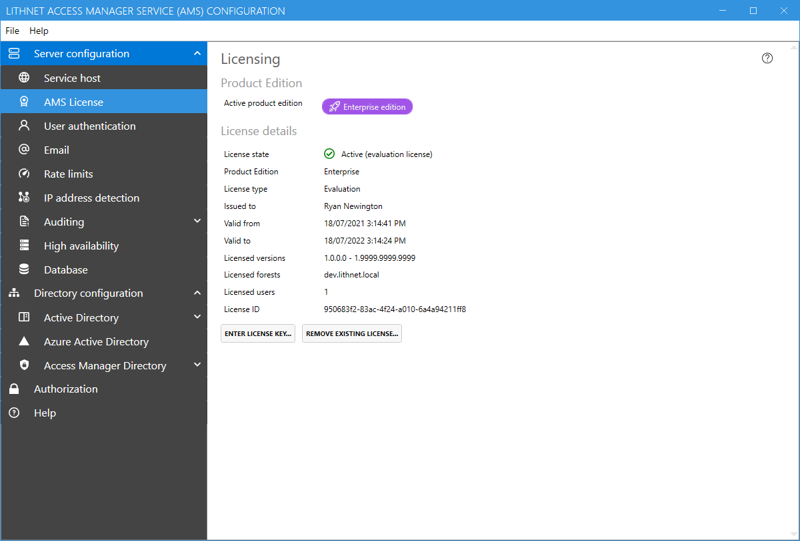

# Licensing configuration page

The licensing page allows you to manage and view your license information.

Community edition users will have the option to enter a license key to upgrade to enterprise edition. See the[ licensing ](../../licensing.md)page for more information.

Once an enterprise license has been assigned, the details of the license are shown, and enterprise features within the application are activated. You can apply a new license at any time by using the `Enter license key` button. To revert to the community edition, simply click `remove existing license`.
