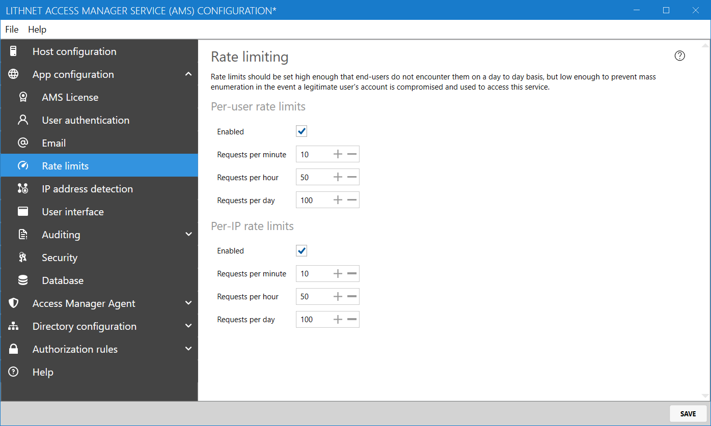

# Rate limit configuration page

Access Manager allows you to limit the number of requests per minute, hour and per day for a given user or IP address. Rate limits are designed to protect against a mass-enumeration attempt, and should be set high enough so that users do not encounter them. 

## Per-user and Per-IP rate limits

#### Enabled

Enables rate limiting according to the specified thresholds

#### Requests per minute

Limits the number of requests for access that can be made per minute to the value provided.

#### Requests per hour

Limits the number of requests for access that can be made per hour to the value provided.

#### Requests per day

Limits the number of requests for access that can be made per day to the value provided.
