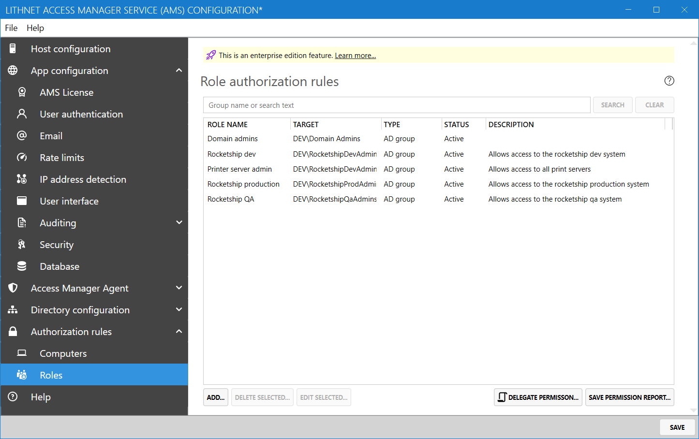
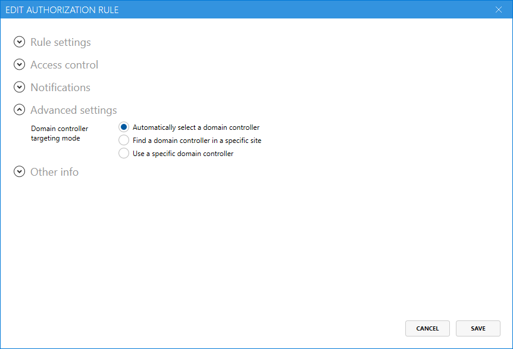

# Role authorization rules page

## Role authorization rules

Access Manager can provide just-in-time access to roles represented by Active Directory groups. Access to roles is provided through role authorization rules. An authorization rule defines the role and who is allowed to access it.

You can add, edit and delete individual rules using the authorization rule editor.

The `Save permission report` tool allows you to export a list of all the principals that are granted access via the selected rules to a CSV file. Note, that any PowerShell based rules are not included in this report.

## Authorization rule editor

### Rule settings

Each role must be given a name that will be shown to users in the web app. Users will also be able to see the description field, which allows you to provide more information about what the role enables access to.

You must select an Active Directory group as the target for the role.

The rule can be disabled at any time by selecting the `disable rule` checkbox. You can also choose to expire the rule at a certain point, by checking the `expire rule` checkbox and selecting the date and time the rule should expire.

### Access control

#### Maximum duration
Specifies the absolute maximum time the user can request access for

#### Default duration
Specifies the time that is pre-filled for the user in the web app when they request access to this role. They can decrease or increase the requested time, up to the value specified by `Maximum duration`

#### Allow user to extend the request before expiry
If the user has previously requested access to the role, and their access has not yet expired, enabling this option will allow them to extend their access duration up to the amount specified by `Maximum duration`.

When this option is disabled, a user who re-requests access before their original access period has expired will not be permitted to extend that access.

#### Edit permissions
Use this option to assign users and groups that are permitted to access this role.

#### Request reason
When a user accesses a role, you can prompt them to provide a reason for accessing the role. You can choose to make this prompt mandatory, optional, or not shown at all.

### Advanced settings

#### Domain controller targeting mode
This option allows you to control how Access Manager selects a domain controller to perform the JIT operation against. This is important, as in multi-site Active Directory environments, there can be delays of 15 minutes between being granted JIT access, and the target system seeing the new group membership. You can choose a targeting mode that ensures that the group membership change is available on a domain controller in the same site as the app or service you are applying permission to.

| Option | Description |
| --- | ---- | 
| Automatically select a domain controller | The AMS service will use the same domain controller that the server it is running on is connected to. This is typically a DC in the same site as the AMS server. |
| Find a domain controller in a specific site | AMS will attempt to locate a DC in the site you specify. If one cannot be found, AMS will default back to its own domain controller |
| Use a specific domain controller | This option instructs AMS to use only the domain controller specified |

### Notifications

Set the audit notification channels you want to be notified on success or failure events for this rule. See [the auditing](auditing-page.md) help topic for information about creating notification channels.
