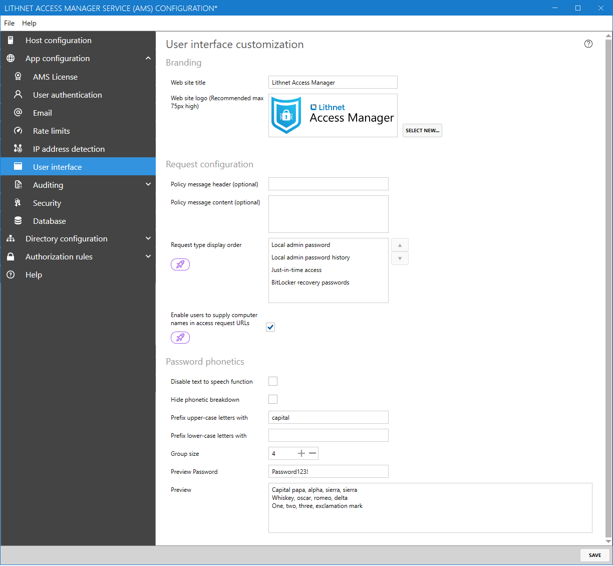
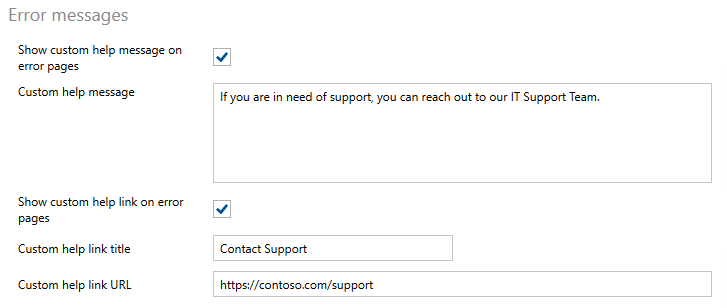

# User interface configuration page

## Branding

#### Website title

If you want to customize the name of the application that users will see in the web interface, you can provide that here. If you leave this blank, the default name will be shown.

#### Website logo

You can replace the Lithnet Access Manager logo with your own company logo by providing it here.

## Request configuration

#### User supplied reason

* Hidden: The user is not given an option to provide a reason for their access request
* Optional: The user will see a field asking them to provide a reason for their access request. This is optional for them to fill out
* Required: The user must provide a reason for their access request

#### Policy message header

Used to optionally shows a custom heading on the access request page

#### Policy message content

Used to optionally show a custom message on the access request page

#### Request type display order
You can reorder this list to change the display order of the request type options shown when a user requests access to a computer.

#### Enable users to supply computer names in access request URLs
When this option is enabled, Access Manager will accept computer access requests with the computer name in the URL. For example, to access a computer named `PC`, a user could use the following URL.

`https://accessmanager.lithnet.local/Computer/AccessRequest?ComputerName=PC1`

## Password phonetics

#### Disable text-to-speech function

The Access Manager web interface provides a text-to-speech function that will read out the value of the password in the NATO phonetic alphabet, where supported by the user's browser.

Selecting this option will hide the text-to-speech function in the web app.

#### Hide phonetic breakdown

The Access Manager web interface provides breakdown of the password in the NATO phonetic alphabet. This makes it easier to read passwords out loud to another person.

Selecting this option will hide the phonetic password breakdown in the web app.

#### Prefix upper-case letters with

Provide a value such as `upper-case` or `capital` to prefix letters with in the phonetic breakdown.

#### Prefix lower-case letters with

Provide a value such as `lower-case` to prefix letters with in the phonetic breakdown. We suggest prefixing only upper-case letters.

#### Group size

Specify how many characters should be in each group in the phonetic breakdown. This changes how many characters are displayed on each line in the phonetic breakdown.

#### Preview password

Type any value in here to see the result of your settings on the output of broken-down password

## Error messages

You can optionally configure custom messages and/or links to appear on error pages.

For example, if a user is unauthorized to request access to a computer, you could provide them organization-specific help information.

#### Show custom help message on error pages

If this box is checked, the text in the `Custom help message` box will appear below any error messages that appear in the Access Manager web app.

#### Show custom help link on error pages

If this box is checked, a button will appear below any error messages that appear in the Access Manager web app.

The name of this button will be the value of the `Custom help link title`, and the button will redirect users to the link specified in the `Custom help link URL` field.

The `Custom help link URL` should be a fully-qualified URL, including a protocol prefix (e.g. `https://`).