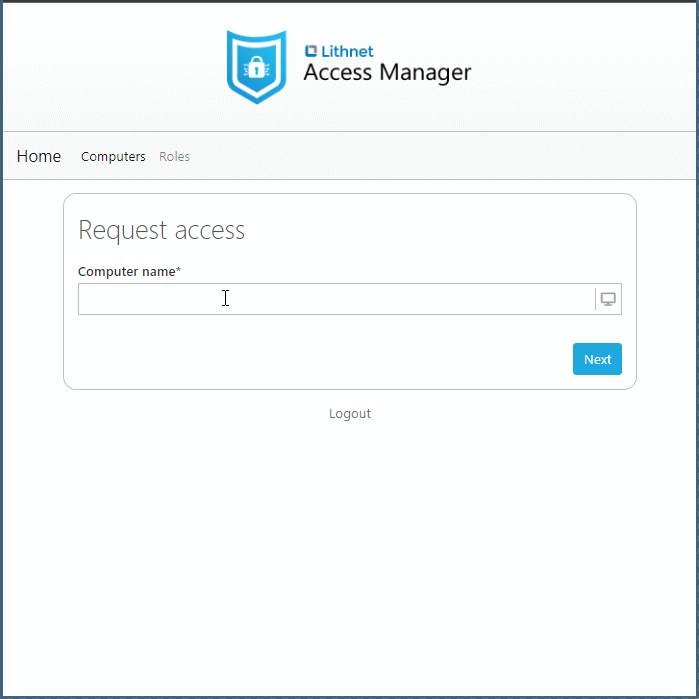

# Getting started with Windows LAPS and Lithnet Access Manager

Microsoft [recently released](https://techcommunity.microsoft.com/t5/windows-it-pro-blog/by-popular-demand-windows-laps-available-now/ba-p/3788747) a new version of Windows LAPS via Windows Update to Windows 10, 11, Windows Server 2019 and above. This new version brings native LAPS capability to all supported operating systems without needing any additional software installation. 

Windows LAPS replaces the 'legacy' LAPS that required a separate installation, and is now built into the operating system itself. It has received major new features including support for Microsoft Entra-joined devices, encrypting LAPS passwords, and storing a history of LAPS passwords.

The great news is that Lithnet Access Manager works with Windows LAPS for Active Directory and Azure Active Directory out of the box! Lithnet Access Manager provides a simple web-based and mobile-friendly interface for accessing local admin passwords. There’s no need to install custom software, or have access to AD administrative tools or PowerShell to access LAPS passwords.

It's MFA-ready with native support for Entra ID, Okta, ADFS, and even smart cards via OpenID Connect. It has easy to use, yet highly customizable auditing capability coupled with a granular and extensible permission model.

When combined, Windows LAPS and Lithnet Access Manager make the perfect pair ❤

We've prepared some quick-start guides for getting started with the new Windows LAPS, and accessing those passwords with Lithnet Access Manager:

* [Getting started with Windows LAPS for Azure Active Directory](getting-started-with-windows-laps-for-azuread.md)
* [Getting started with Windows LAPS for Active Directory](getting-started-with-windows-laps-for-ad.md)
