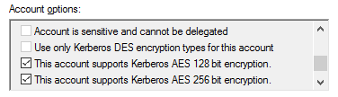

# KB000012: Troubleshooting Windows authentication in the Access Manager Web App

## Summary

Incorrect configuration of Windows authentication can cause users to be trapped in an authentication loop. This prevents them from accessing the web application.

## Cause

There are several possible causes for Windows authentication not working.

### 1. Incorrect SPN

The hostname that the user types into their address bar must be registered as an SPN on the service account in Active Directory. The SPN must be in the format of `HTTP/hostname` where `hostname` is the fully qualified host name that the user is entering into their browser.

```
You can use the `setspn` command to manage SPNs.
    - View a list of SPNs assigned to a service account `setspn -L domain\serviceaccount`
    - View which account an SPN is assigned to `setspn -Q HTTP/hostname`
    - Set the SPN on a service account `setspn -S HTTP/hostname domain\serviceaccount`
```

### 2. Mismatched encryption types

Ensure that AES encryption types are enabled for the AMS service account. If you have performed hardening and disabled RC4, enabling AES may be required to ensure that a compatible encryption type can be negotiated.



### 3. Use of CNAME records

Chrome-based browsers have a behavior where they [try to authenticate as the target of the CNAME record](https://www.chromium.org/developers/design-documents/http-authentication/).

If the user types `https://ams.lithnet.io` in their address bar, Chrome checks to see if `ams.lithnet.io` is a CNAME. If it is, rather than requesting a Kerberos ticket for `HTTP/ams.lithnet.io`, it requests it for the underlying A record target instead. This is typically the machine itself, e.g., `HTTP/AMS1.domain.local`.

The AMS service performs authentication as the service account, rather than the machine account. As a result, mutual authentication fails.

Possible solutions for this

* Convert the `ams.lithnet.io` record to an A record
* Use Chrome policy to [disable this behavior](https://chromeenterprise.google/policies/#DisableAuthNegotiateCnameLookup). However, be aware this will impact all sites using Windows authentication. It should be tested carefully to ensure it doesn't impact other services.
