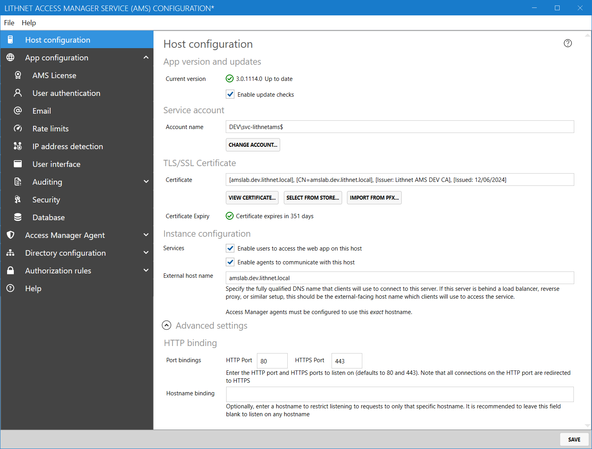

# Enabling agent support on the AMS server

 Managing more than 100 devices requires an  [Enterprise edition license](../../access-manager-editions.md)

The Lithnet Access Manager agent is an optional component you can deploy in your environment that provides a host of additional features that compliments the Access Manager server.

You should deploy the agent when you want to take advantage of the following capabilities
* Using the RapidLAPS passwordless LAPS login feature
* Using passphrases for LAPS passwords, instead of random characters
* Backing up BitLocker recovery keys from AD-joined, Entra-joined, and standalone Windows devices
* Managing the root password on macOS and linux devices

The following guide outlines the steps required to enable agent support on the Access Manager server

## Step 1: Enable agents to communicate with the AMS server

From the `Host configuration` page, tick `Enable agents to communicate with this host`, and specify the host name clients will use to connect to the server. This must match the DNS name in the active TLS/SSL certificate, or clients will be unable to connect.


If you wish to allow agents to register with their Active Directory identity, you will need to configure a service principal name (SPN) on the service account used by the Access Manager Service.
../../images/ui-page-host-configuration.png
If this SPN is not set, the following warning will appear in the `Service account` section of the `Host configuration` page:



Use the script provided to correctly set the SPN on the AMS service account.
../../images/spn-warning.png

## Step 2: Enable device registration modes

From the `Access Manager Agent/Agent registration` page, select the methods devices will use to  register with the AMS server:
- Windows authentication can be used to automatically register agents on Active Directory-joined devices
- Microsoft Entra authentication can be used to register agents on Entra-joined devices.
- Registration keys can be configured to register agents on all other devices.


Devices require line-of-site to a domain controller to register using with Windows authentication. If you have devices that will not have line-of-site to a domain controller at registration time (e.g. workstations that might be off the network), then ensure you select the option to enable NTLM authentication. 

Windows authentication is only used for the initial agent registration, and line-of-site to a domain controller is not required for normal operations.


If you do not plan on using Microsoft Entra authentication, then the setup process is complete.

## Step 3: Configure Entra ID tenant

If you enable devices to register with Microsoft Entra authentication, you must register your Entra ID tenant details, and grant permission for the service to read device information from the directory.

### Create the Entra app registration
Follow the steps in [Creating an Entra app for Access Manager](../../help-and-support/advanced-help-topics/creating-an-entra-app.md) to create the app registration for Access Manager. Take note of the tenant ID, client ID and secret created here as they will be used in the next step.

Ensure that the appropriate API permissions have been granted for the `Deploying the Access Manager Agent to Entra-joined devices` scenario.

### Configure the service account details in Access Manager

1. Open the Lithnet Access Manager Service Configuration Tool
2. Select the `Directory configuration/Microsoft Entra` page
3. Press the `Add...` button to add a new tenant configuration
4. Add the client ID, secret, and directory/tenant ID in the fields provided
5. Save the tenant configuration


You may need to wait a minute or two for the secret and delegation to become active


Access Manager is now configured to support Microsoft Entra joined devices.
