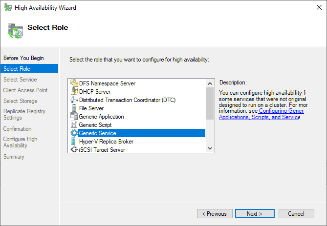
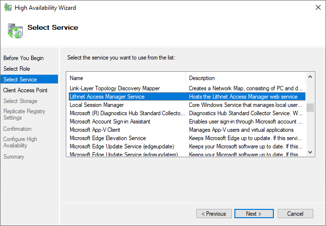
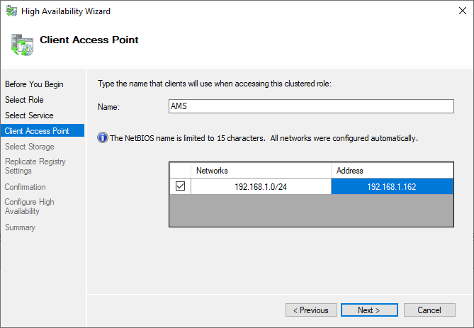
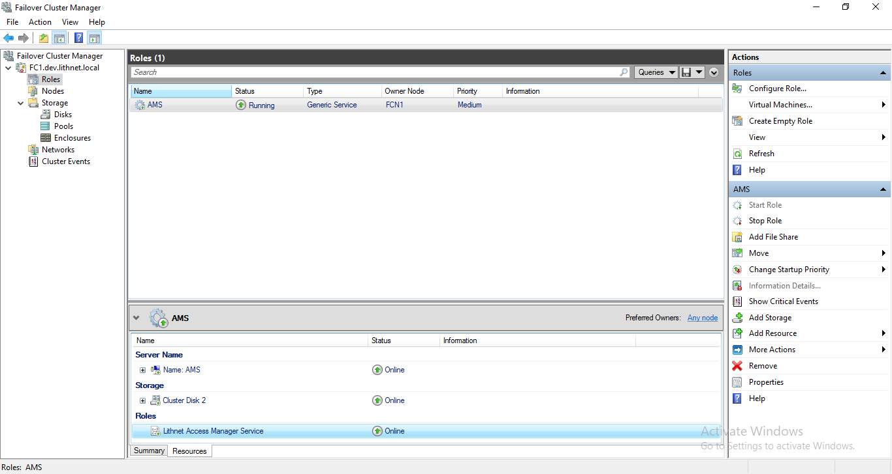

# Installing Access Manager in a Failover Cluster

 High availability is an [Enterprise edition feature](../../access-manager-editions.md)

## Prerequisites

Installing Access Manager in a failover cluster requires the following;

* A Lithnet Access Manager enterprise edition license
* At least one Windows Server 2012 R2 domain controller in the domain where AMS will be installed
* The [KDS root key](https://docs.microsoft.com/en-us/windows-server/security/group-managed-service-accounts/create-the-key-distribution-services-kds-root-key) in the domain must be enabled
* The same account must be used on all hosts in the farm. A group-managed service account is strongly recommended
* Each host must be running the same version of the Access Manager Service at all times
* An external SQL server, or an SQL server that is installed in the same cluster where Access Manager will be installed
* You must meet the hardware and storage requirements for a [Microsoft failover cluster](https://docs.microsoft.com/en-us/windows-server/failover-clustering/clustering-requirements)

> Note: It is not supported to use SQL express when deploying Access Manager into a Failover Cluster

## Installation procedure

### 1. Install and configure the base cluster service

Follow the steps outlined in [Microsoft documentation](https://docs.microsoft.com/en-us/windows-server/failover-clustering/create-failover-cluster) for creating a new failover cluster. Stop once you reach the section for `Creating clustered roles` and continue from this guide.

### 2. Configure the cluster quorum

If you are setting up a cluster containing an even number of nodes, you must configure an appropriate [witness](https://docs.microsoft.com/en-us/windows-server/failover-clustering/manage-cluster-quorum) to ensure a cluster quorum.

### 3. Install Access Manager

* On the first node, run the Access Manager Service installer.
* Enter the name of a group-managed service account when prompted. You must use the same account on all cluster nodes.
* Specify the connection string to the SQL server you want to use with this instance. Note, SQL Express is not supported when installing Access Manager in a cluster.
* When the installer finishes, launch the `Lithnet Access Manager Configuration Tool` from the start menu
* Start the service if prompted, and navigate to the `Host configuration` page.
* Import or select the SSL certificate you want to use for this host. Enable the web app and API as required. 
* On the licensing page, provide your AMS license key
* Save the config, and restart the service when prompted
* Repeat this process for the next cluster node. Make sure to use identical service accounts, connection strings, and SSL certificates on each server. You will not need to provide the license key after installing it on the first node.

### 5. Install the cluster role

* Once AMS has been installed on all nodes, open the `Failover Cluster Manager` and go to the `Roles` node of the cluster
* Click `Configure rule...` from the `actions` pane
* Select `Generic service` as the role type

* Select `Lithnet Access Manager Service` from the services list

* Provide an IP address and name for your client access point. This will be the name of the clustered service, and by default, forms the AD hostname of the cluster

* Skip the shared storage and registry replication screens, and complete the remaining steps of the wizard
* Ensure the new role transitions to an 'online' state

* Use the `Failover Cluster Manager` to move the role on each node, testing that the service starts correctly on each node.

At this point, the cluster-specific configure is complete. You can now follow the steps in the [installation guide](installing-the-access-manager-service.md) for configuring the AMS features as appropriate for your environment.
