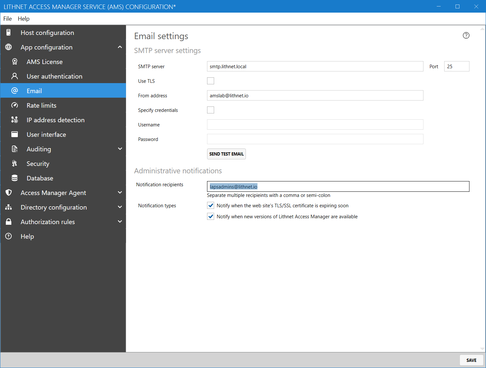
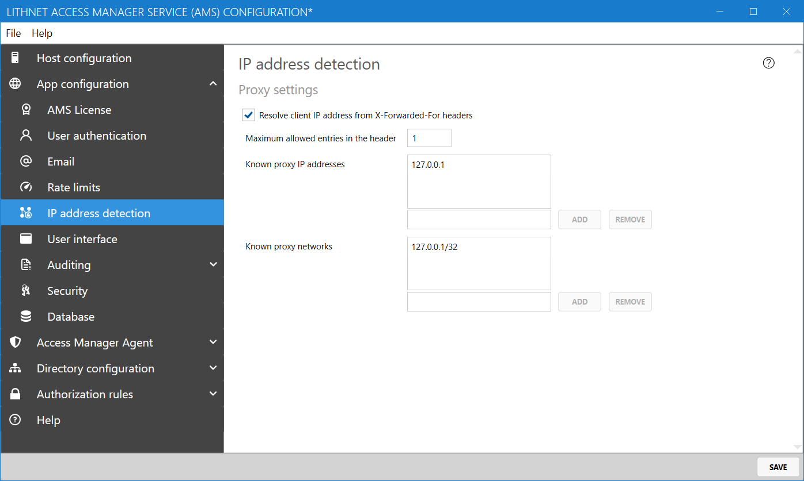
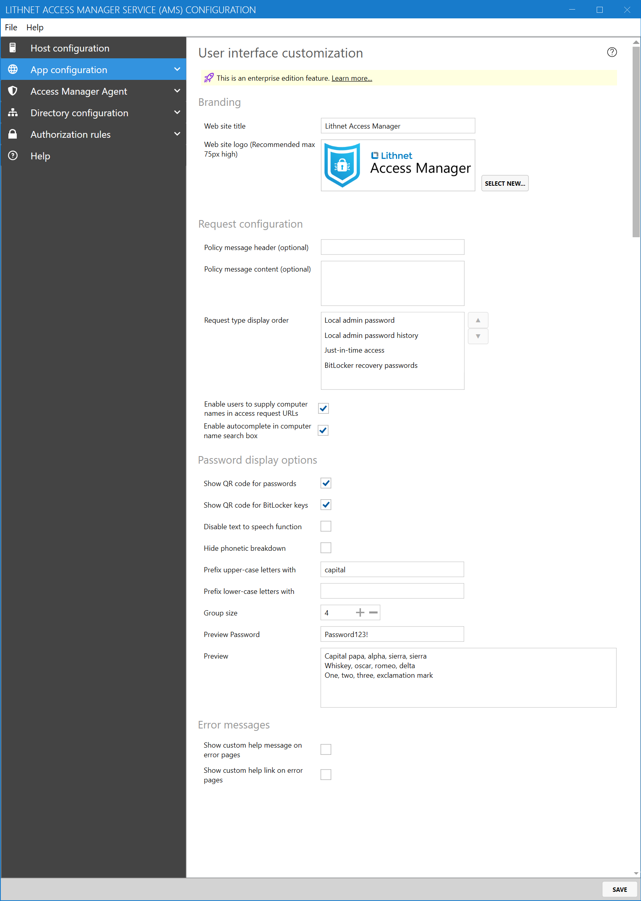
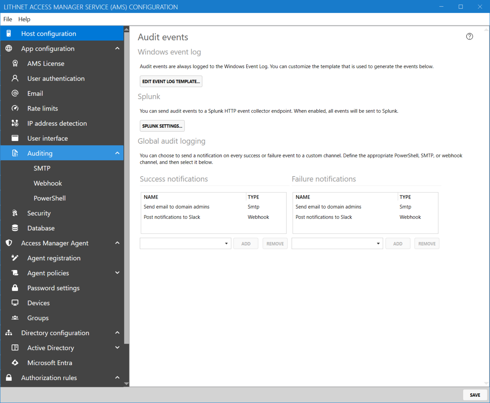
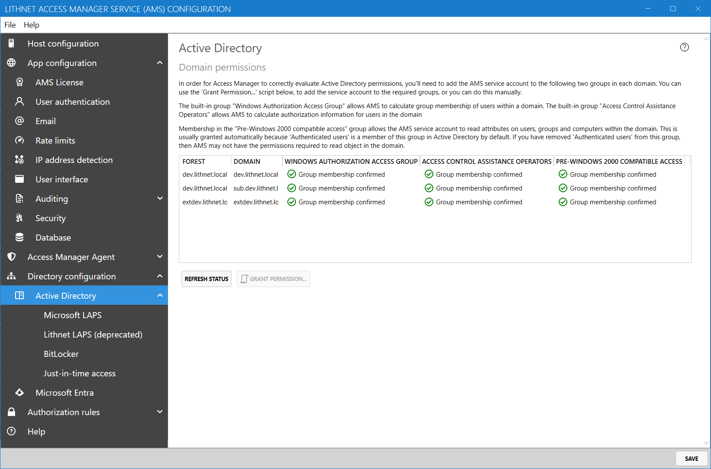

# Installing the Access Manager Service

## Prerequisites

In order to install the Access Manager Service, the following prerequisites must be met;

1. Windows Server 2016 or later
2. [.NET Desktop Runtime](https://dotnet.microsoft.com/download/dotnet-core/6.0/runtime) 6.0.10 or later installed
3. [.NET Hosting Bundle](https://dotnet.microsoft.com/download/dotnet-core/6.0/runtime) 6.0.10 or later installed
4. Microsoft SQL Express 2019, if hosting the database locally, or a separate SQL Standard or Enterprise edition server. (SQL express is installed by default)
5. If you plan to use SQL Express, but the server you are installing on does not have an internet connection, then [download the SQL Express installer](https://download.microsoft.com/download/7/c/1/7c14e92e-bdcb-4f89-b7cf-93543e7112d1/SQLEXPR_x64_ENU.exe) and copy it to the server. You'll be asked to specify the installation file during setup.
6. A TLS certificate for the AMS website

The installer can download the prerequisites when an internet connection is available. You can read the guide on [what internet access is required](../../help-and-support/advanced-help-topics/internet-access-requirements.md) for automatic prerequisite installation.

## Step 1: Create a service account

The Access Manger Service needs to run under the context of a domain user account. We strongly recommend using a group-managed service account for this purpose. [We've created a guide for setting up a GMSA](creating-a-service-account-for-the-access-manager-service.md) which includes a script to get you up and running quickly.

Do not grant any specific permissions to this account and most certainly don't add it to super-privileged groups like Domain Admins. As you go through the setup process, you'll be given scripts to delegate permissions specific to the functionality you want to enable.

## Step 2: Prepare an SSL certificate

Determine the host name you will use to access AMS and request an SSL certificate from your certificate provider. Install the certificate in the 'personal' store of the local computer.

You can use the following command to create a self-signed SSL certificate suitable for testing, replacing the DNS name with the name of your AMS server

```
New-SelfSignedCertificate -DnsName "ams.domain.local" -CertStoreLocation "cert:\LocalMachine\My"
```

## Step 3: Download and install the AMS service

1. Download the latest version from the [downloads](../downloads.md) page.
2. Download and install the [.NET Desktop runtime and the .NET hosting bundle](https://dotnet.microsoft.com/download/dotnet-core/6.0/runtime), or if your server has internet access, you can let the installer download and install these for you
3. Run the AMS installation package. Follow the prompts to install the application and provide the service account created in step 1 when prompted.

## Step 4: Configure the host
Launch the `Access Manager Service configuration tool` from the start menu. 


From the `Host configuration` page, click the `Select from store...` button and select the certificate you installed in step 2.

Select the option to enable the web app, to allow users to request access to computers and roles. If you plan on using the Lithnet Access Manager Agent, then select the option to enable the Access Manager API.

Click `File`, then `Save`.

[More information on configuring the host](../../help-and-support/app-pages/host-configuration-page.md)

## Step 5: Configure your authentication provider

AMS supports several authentication providers. Read the guide on [configuring authentication](../../configuration/setting-up-authentication/) and choose an authentication provider. We strongly recommend using a modern authentication provider that supports strong authentication and can enforce multifactor authentication. While integrated windows authentication is provided, we recommend you only use this for testing purposes.

## Step 6: Configure outbound email settings



You'll need to configure an outbound mail server in order to receive audit alerts via email.

[More information on email settings](../../help-and-support/app-pages/email-page.md)

## Step 7: Set up rate limits


In order to ensure that your service is not used inappropriately, you can place limits of the number of requests a user can make in a given time. You should set these high enough that your users are not going to encounter rate limit issues under normal usage, but low enough to limit the impact of inappropriate or malicious usage of the service.

[More information on rate limiting](../../help-and-support/app-pages/rate-limits-page.md)

## Step 8: Configure IP Detection



If you put AMS behind a reverse proxy or load balancer, you'll need to configure IP address detection. This is to ensure that AMS logs the correct IP address in audit logs, and applies rate limiting correctly.

[More information on IP address detection](../../help-and-support/app-pages/ip-address-detection-page.md)

## Step 9: Customize the Web user interface



Configure the user interface as per your organization's requirements. You can customize the name of the application, provide your own logo and even provide some custom policy text for the access request page.

[More information on user interface settings](../../help-and-support/app-pages/user-interface-page.md)

## Step 10: Configure Auditing



AMS has a powerful auditing engine that allows you to receive notifications when access is granted or denied to a user. AMS logs audit events to the Windows event log all the time, but you can also send audit events via email, through a custom PowerShell script, or even to Slack or Microsoft Teams using a web hook.

[More information on Auditing](../../help-and-support/app-pages/auditing-page.md)

## Step 11: Configure Active Directory permissions



From the `Active Directory` tab, check that the AMS service account is a member of the `Windows Authorization Access Group` and `Access Control Assistance Operators` built-in groups within each domain. This is required for the AMS service account to be able to calculate access permissions for users and computers within these domains. If any permissions are missing, use the `Grant permission` button to generate a script to grant them.

You will need to restart the service to pick up the new group membership in the local domain.

## Step 12: Configure access to local admin passwords, just in time access, and BitLocker

Now that you have the core application set up, you can configure the Access Manager features you are interested in;

* [Setting up Microsoft LAPS](../../configuration/deploying-features/setting-up-microsoft-laps.md)
* [Setting up Lithnet LAPS for Active Directory, Azure AD, macOS and Linux](../../configuration/deploying-features/setting-up-lithnet-laps/)
* [Setting up JIT access for computers](../../configuration/deploying-features/jit/setting-up-jit-for-computers.md)
* [Setting up JIT access for roles](../../configuration/deploying-features/jit/setting-up-jit-for-roles.md)
* [Setting up BitLocker access](../../configuration/deploying-features/setting-up-bitlocker-access.md)